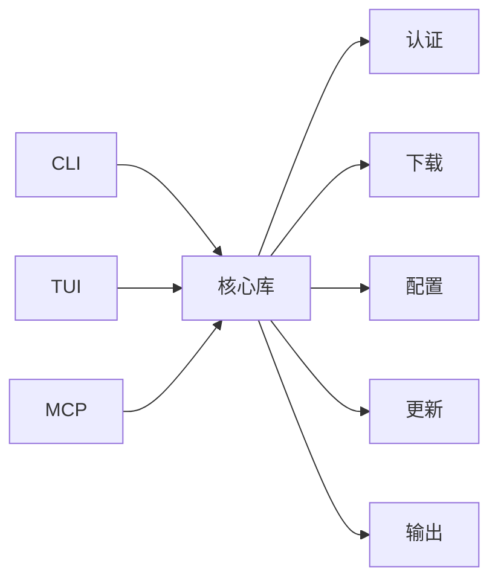

# GoQuark

[English](README.en.md) · 中文

<p align="center">
  
</p>

<p align="center">
  <strong>非官方</strong> 夸克网盘 CLI / TUI / MCP 客户端
</p>

<p align="center">
  扫码登录 · 高速下载 · 交互式网盘 · Agent 友好
</p>

<p align="center">
  
  
  
  
</p>

---

## 这是什么？

GoQuark 是用 **Go** 写的夸克网盘客户端，面向命令行与自动化场景：

| 场景 | 能力 |
|------|------|
| 登录 | 夸克 APP **扫码登录** |
| 下载 | **贴近真实客户端** 的下载速度；队列、暂停/继续、进度与 ETA |
| 浏览 | 终端 **TUI**：点选、多选、右键菜单、下载中心 |
| 脚本 | CLI + 管道 / `--json` 输出 |
| Agent | **MCP**（stdio），可接入 Claude Desktop、Cursor 等 |

> **非官方项目。** 与夸克、UC、阿里巴巴集团及其关联公司无隶属、授权或合作关系。  
> 仅供学习与研究，风险自负。详见 [免责声明](#免责声明) 与 [DISCLAIMER.md](docs/DISCLAIMER.md)。

---

## 功能一览

- 扫码登录，设备信息本地固定、可自定义名称  
- 多文件下载、下载中心、历史记录  
- 暂停 / 继续 / 取消；退出时安全收尾  
- 目录浏览、用户信息（`ls` / `whoami`）  
- 终端 UI（支持鼠标）  
- MCP 工具：状态、设备、用户、列目录、下载队列、更新  
- 版本号由构建注入（见 [版本](#版本)）

<p align="center">
  
</p>

> ⭐ 如果这个项目对你有帮助，欢迎点个 **Star** 支持一下！

---

## 组件架构

入口是 **CLI / TUI / MCP**，共用同一套核心库。



| 模块 | 说明 |
|------|------|
| **CLI** | 命令行入口：登录、列目录、下载、更新等 |
| **TUI** | 终端交互界面：浏览、多选、下载中心 |
| **MCP** | stdio 工具，供 Agent 调用同一能力 |
| **核心库** | 认证、下载、配置、更新、输出等共用逻辑 |

---

## 安装

**推荐：一键安装**（自动从 [GitHub Releases](https://github.com/ButterFuture/GoQuark/releases) 拉取对应系统的二进制，无需安装 Go）：

```bash
curl -fsSL https://raw.githubusercontent.com/ButterFuture/GoQuark/main/scripts/install.sh | bash
```

安装位置默认 `~/.local/bin/goquark`（若可写则用 `/usr/local/bin`）。可选参数：

```bash
# 指定版本 / 目录
curl -fsSL https://raw.githubusercontent.com/ButterFuture/GoQuark/main/scripts/install.sh | bash -s -- --version v1.0.3
curl -fsSL https://raw.githubusercontent.com/ButterFuture/GoQuark/main/scripts/install.sh | bash -s -- --dir ~/.local/bin
```

**或手动下载 Release：**

1. 打开 <https://github.com/ButterFuture/GoQuark/releases>
2. 选择系统对应文件，例如：
   - Linux x64 → `goquark_*_linux_amd64`
   - Linux ARM64 → `goquark_*_linux_arm64`
   - macOS Apple Silicon → `goquark_*_darwin_arm64`
   - Windows → `goquark_*_windows_amd64.exe`
3. （可选）用同目录 `SHA256SUMS` 校验
4. `chmod +x goquark_*` 后移到 `PATH` 中，并重命名为 `goquark`

```bash
chmod +x goquark_1.0.3_linux_amd64
sudo mv goquark_1.0.3_linux_amd64 /usr/local/bin/goquark
```

安装完成后，**推荐直接启动 TUI**：

```bash
goquark tui
```

升级：重新执行安装脚本，或使用 `goquark update --yes`（TUI 内也可检查更新）。

<details>
<summary>自行编译（可选，需 Go 工具链）</summary>

见 **[docs/BUILD.md](docs/BUILD.md)**。

</details>

---

## 快速开始

**首选：TUI**（浏览、下载、下载中心都在终端里完成）

```bash
goquark tui
```

首次使用会引导扫码登录。之后多数操作建议继续用 TUI。

<details>
<summary>命令行用法（脚本 / 自动化）</summary>

```bash
goquark login          # 扫码登录（终端出码 + qrcode.png）
goquark device         # 设备信息
goquark whoami         # 当前用户
goquark ls /           # 列目录
goquark download /云盘路径/文件.mkv
goquark downloads      # 任务列表
goquark downloads --watch
goquark mcp            # MCP（stdio）
goquark version
```

</details>

| 配置项 | 说明 |
|--------|------|
| 配置文件 | `~/.config/goquark/config.json` |
| 覆盖方式 | 环境变量 `GOQUARK_CONFIG` 或参数 `-config` |
| 默认下载目录 | `~/Downloads/GoQuark`（可用 `download_dir` / `GOQUARK_DOWNLOAD_DIR`） |

登录态与 Cookie **仅保存在本机**。请勿把含 Cookie 的配置提交到 Git 或发给他人。

---

## TUI 快捷键（摘要）

| 按键 | 作用 |
|------|------|
| 单击 / 空格 | 选择 |
| `d` | 下载所选 |
| `t` | 下载中心 |
| 右键 / `m` | 菜单 |
| `p` / `r` / `x` / `c` | 暂停 / 恢复 / 取消 / 清除已完成（中心内） |
| `q` | 退出（确认后安全暂停进行中的任务） |

---

## MCP

通过 **stdio** 提供服务：宿主启动 `goquark mcp`（需**绝对路径**）。

1. 安装 `goquark` 到固定路径  
2. 在 Claude Desktop / Cursor 等宿主里配置下方 JSON  
3. Agent 可通过工具完成登录（扫码）、浏览、下载等；工具列表由 MCP 宿主自动发现

### Claude Desktop

- macOS: `~/Library/Application Support/Claude/claude_desktop_config.json`  
- Windows: `%APPDATA%\Claude\claude_desktop_config.json`

```json
{
  "mcpServers": {
    "goquark": {
      "command": "/path/to/goquark",
      "args": ["mcp"]
    }
  }
}
```

### Cursor / 其它 stdio 宿主

```json
{
  "mcpServers": {
    "goquark": {
      "command": "/path/to/goquark",
      "args": ["mcp"]
    }
  }
}
```

<details>
<summary>更多：MCP工具一览</summary>

| Tool | 说明 |
|------|------|
| `goquark_status` | 登录态 / 配置 / 版本 |
| `goquark_login` | 发起扫码登录，返回 **明确标注** 的 `qr_url` / `qr_content` / `qr_ascii` |
| `goquark_login_poll` | 轮询扫码结果至 `logged_in` |
| `goquark_device` | 本地设备信息 |
| `goquark_whoami` | 当前用户 |
| `goquark_ls` | 列目录 |
| `goquark_stat` | 路径 / fid 元数据 |
| `goquark_download` | 下载 |
| `goquark_downloads` | 下载任务列表 |
| `goquark_download_control` | 暂停 / 恢复 / 取消 |
| `goquark_check_update` | 检查更新 |
| `goquark_update` | 应用更新（`apply=true`） |

</details>

---

## 版本

| 项目 | 说明 |
|------|------|
| 唯一来源 | 仓库根目录 [`VERSION`](VERSION)（当前 **1.0.3**） |
| 构建注入 | `scripts/build.sh` / CI 通过 `-ldflags` 写入二进制 |
| 本地 `go run` | 未注入时显示 `dev` |

```bash
./scripts/version.sh   # 打印版本
./scripts/build.sh     # 带版本构建
goquark version        # 查看已注入版本
```

发版建议：改功能 → 确认 → 更新 `VERSION` → 打 tag `v1.0.3` → CI / Release。

---

## 技术栈

| 层级 | 选型 |
|------|------|
| 语言 | Go |
| TUI | Bubble Tea、Lip Gloss |
| 网络 | Go `net/http`、TLS |
| Agent | MCP（stdio） |
| 配置 | JSON（`~/.config/goquark/`） |

下载侧使用多连接 HTTP 与本地任务管理（队列、暂停/继续、进度 UI），目标是 **贴近真实客户端的下载速度**。

---

## 开源协议

本仓库原创代码采用 **[GNU Affero General Public License v3.0 (AGPL-3.0)](LICENSE)**。

- **要求保留版权与许可证声明**（署名）  
- **Copyleft**：修改后的版本若对外提供服务（含网络服务）或分发，须以 AGPL-3.0 提供对应源码  
- 第三方依赖各自许可证不变  
- 第三方致谢与许可证清单见 [`docs/ACKNOWLEDGMENTS.md`](docs/ACKNOWLEDGMENTS.md)  

```text
Copyright (c) 2026 ButterFuture
```

---

## 免责声明

**使用前请完整阅读。使用本软件即视为接受下列条款。**

1. **非官方** — 非夸克 / UC / 阿里产品，无任何官方担保。  
2. **学习研究** — 请勿用于违反法律或平台服务条款的行为。  
3. **风险自负** — 账号、数据、隐私、会员权益等后果由使用者承担。  
4. **版权** — 你下载与传播的内容合法性由你负责。  
5. **按现状提供** — 无适销性等担保；接口可能变更，无强制维护义务。  
6. **第三方库** — 遵守各自许可证。  

摘要见 [DISCLAIMER.md](docs/DISCLAIMER.md)。

### 权利通知

邮箱：`ButterFuture@proton.me`  
标题建议：`[GoQuark] 权利通知 / Takedown`  
请尽量提供：主体与联系方式、具体路径/提交、权利依据、希望的处理方式。

---

## 安全提示

- 勿在聊天、截图、CI 日志中泄露 `config.json` 中的 Cookie  
- 仅在可信环境运行 CLI / MCP  
- 安装二进制时请核对 Release 校验和  

---


## 文档目录

| 文档 | 说明 |
|------|------|
| [`docs/DISCLAIMER.md`](docs/DISCLAIMER.md) | 免责声明 |
| [`docs/CHANGELOG.md`](docs/CHANGELOG.md) | 更新日志 |
| [`docs/ACKNOWLEDGMENTS.md`](docs/ACKNOWLEDGMENTS.md) | 第三方依赖与许可证声明 |
| [`docs/README.md`](docs/README.md) | 文档索引 |
| [`LICENSE`](LICENSE) | AGPL-3.0 全文 |

## 状态

**v1.0.3** — 安全加固：自更新校验和验证、更新来源锁定、文件名与登录二维码加固；在 v1.0.2 能力之上。

后续计划：公开仓正式发版通道、应用内检查更新（可选）、更丰富的 MCP 能力。

---

<p align="center">
  Made with Go · AGPL-3.0 · Unofficial
</p>
